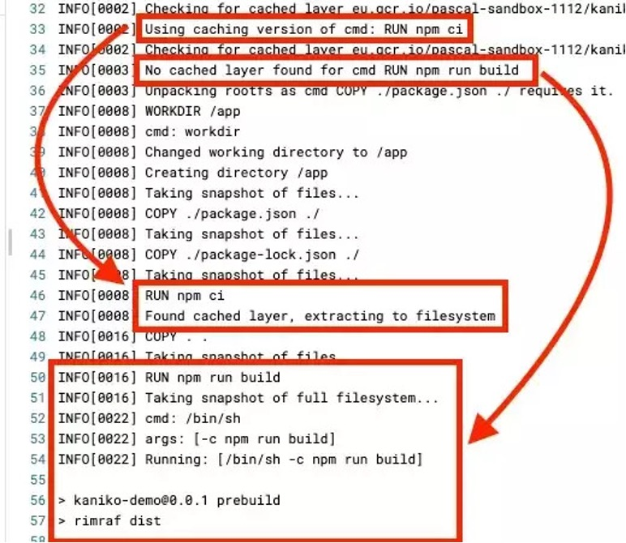
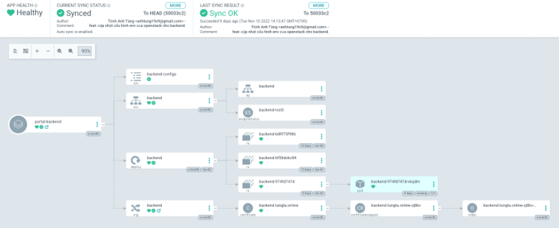
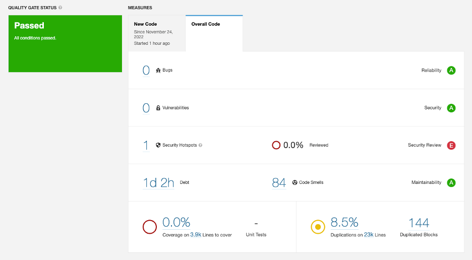
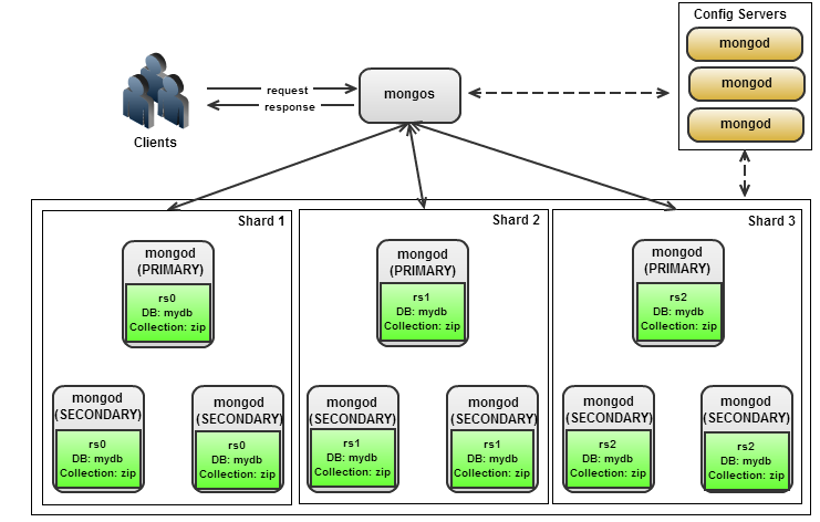
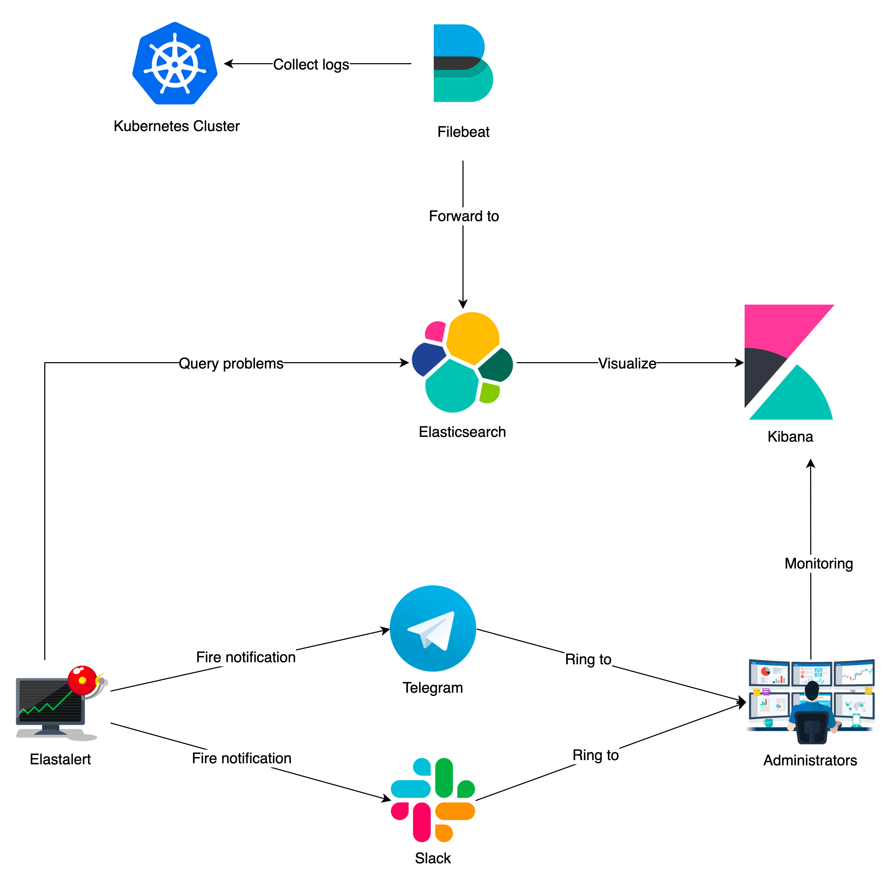

## **Introduction**
First but not least, this is my recommenced infrastructure on GCP. It depends on your requirements. I will explain step by step to reach it.


*Figure 1.1.1. Overview of infrastructure*

About this infrastructure, I focus on presenting as code and reducing manual operations as much as possible. Below are the technical choices I used:

- **Repository**: Gitlab
- **IaC**: Terraform
- **Orchestration tool**: Kubernetes, here is GKE
- **Service mesh**: Istio
- **Logging Management**: Elasticsearch
- **Storage**: Google Cloud Storage
- **Monitoring**: Prometheus, Grafana, Kiali
- **Tracing**: Jaeger
- **Database**: MongoDB Sharded
- **Continuous Delivery**: ArgoCD
- **Continuous Integration**: Gitlab-CI
- **Secret and Encryption**: Hashicorp Vault
- **Container Registry**: Gitlab Container Registry
- **Infrastructure Backend**: GitLab-managed Terraform state
- **SAST**: SonarQube
- **DAST**: ZAProxy
- **Backup & DR**: Google Cloud Backup & DR

With this tech stack, we will explain how we can solve them one by one problem.
## **Provisioning Infrastructure**
On GCP, we only use several services: 

- Google Kubernetes Engine
- Google Cloud Storage
- Google Backup and DR
- Google Compute Instance

We prefer to use Open Source and try to install everything on GKE. Firstly, I must create your GCP services with Terraform but Terraform state has to save in Gitlab Backend. With the state lock feature, I can resolve conflict problems when many DevOps engineers try to apply changes simultaneously.


*Figure 1.2.1. State Lock feature of Gitlab Backend*

After we create GKE with Terraform, we also develop resources into GKE with Helm and Kubernetes Provider. For example:

```HCL
resource "helm_release" "ingress_nginx" {
  name = " ingress_nginx "

  repository = "https://kubernetes.github.io/ingress-nginx"
  chart      = "ingress-Nginx"
  version    = "3.30.0"

  set {
    name  = "controller.service.type”
    value = "ClusterIP"
  }

  set {
    name  = "defaultBackend.enabled”
    value = true
  }
  depends_on = [google_container_node_pool.node_pool]
}
```

## **CI/CD**
Gitlab Runner will trigger all CI/CD processes. I preferred Kubernetes Executor for Gitlab Runner for high build frequency. Otherwise, for a flexible environment, I can prepare the base environment to build, run and reload for almost case.


*Figure 1.3.1. CI/CD Pipeline*

With this pipeline, our application has been automated from the build stage to reload stage. I chose Kaniko to build the container image because I don’t want to use privileges permission when I prepare an environment to run a job. Kaniko also helps me reuse cache layers of my previous image. It will scan my registry and determine all existing layers.
### **Kaniko**
Kaniko can cache layers created by RUN and COPY commands in a remote repository. Before executing a command, kaniko checks the cache for the layer. If it exists, kaniko will put and extract the cached layer instead of running the command. If not, kaniko will execute the command and then push the newly created layer to the cache:



*Figure 1.3.2. Example about cache layer of Kaniko*

About security, Kaniko replies on the security features of my container to provide build security. The minimum permissions kaniko needs inside my container are governed by a few things:

- The permissions required to unpack my base image into its container
- The permissions needed to execute the RUN commands inside the container.
### **ArgoCD**
I chose ArgoCD for my CD process because three reasons:

- I want to manage all resources on Kubernetes centrally.
- All manifests of my application have been created declarative and then saved into Gitlab Repository.
- Outside services shouldn’t talk with Kubernetes directly.

I think that Gitlab Runner will trigger a job with an image containing ArgoCD-cli. My reload job will read my ARGOCD_AUTH_TOKEN from the environment variable of that context, then use it to connect ArgoCD Server to Kubernetes:


*Figure 1.3.3. ARGOCD_AUTH_TOKEN variable*

In my pipeline, reload job only needs me to fill the ARGOCD_SERVER variable point to ArgoCD ServiceName on Kubernetes, for example:

```YAML
deploy_dev:
  image: anhtung19x9/argocd-cli:latest
  stage: reload
  only:
    - dev
  needs:
    - build_and_push_dev
  variables:
    ARGOCD_SERVER: 'argocd-server.argocd:443'
  script:
    - argocd app actions run backend restart --kind Deployment
```

Before anything, I have to create manifests for my application and push them to the project repository like this:


*Figure 1.3.4. The manifest file of the application*

Then, I can provision my application into ArgoCD. With ArgoCD, I can prevent someone from carelessly deleting or changing my resource configs. If that bad thing happens, ArgoCD will help me roll back and keep my resources in the same configuration on the repository. 

ArgoCD has three sync options:

- **AUTOMATED**: All new changes from the repository have been synced to Kubernetes.
- **PRUNE RESOURCES**: Old resources that did not exist in the repository will be removed.
- **SELF-HEAL**: All changes made by someone manually without ArgoCD won’t override by ArgoCD.

Example about ArgoCD manages my resources:



*Figure 1.3.5. ArgoCD manages and syncs configurations.*
### **Newman**
One of the stages I think we should have is API Automation Testing for Golang Application. Newman is my preferred tool for that purpose. I like it because Newman **will read the collection from Postman and help you run API tests.** This method will be beneficial because I only need my Backend Developer to export their Postman Collection and push it into the repository. The results will be written in both the HTML file and the job log. It triggers sent result to Telegram Channel like this:


*Figure 1.3.6. Result Report in Telegram*
### **SonarQube**
SonarQube will help me complete my SAST Stage. In my pipeline, I have to configure SAST Job like this:

```YAML
sonarqube-check:
  stage: sast
  image:
    name: sonarsource/sonar-scanner-cli:latest
    entrypoint: [""]
  variables:
    SONAR_USER_HOME: "${CI_PROJECT_DIR}/.sonar"
    GIT_DEPTH: "0"
  cache:
    key: "${CI_JOB_NAME}"
    paths:
      - .sonar/cache
  script:
    - sonar-scanner
  allow_failure: true
  only:
    - develop
```

Then, depending on my quality gate profile, my code will pass or fail. It will show everything about each evaluation criterion, like Reliability, Security, and Maintainability.



*Figure 1.3.7. SonarQube Dashboard*

### **ZAProxy**
For DAST, I will bring my application to Kubernetes and use ZAProxy to scan it from the Internet. The main point here is that I want to know if my application has any vulnerabilities or critical problems if I was public client access. All things I have to do that configure the pipeline will run the ZAProxy container like this:

```YAML
stages:
- scan
dast: 
  stage: scan
  image:
    name: zap2docker-weekly:latest
  before_script:
    - mkdir -p /zap/wrk
  script:
    - zap-full-scan.py -t "https://testphp.vulnweb.com" -I -r testreport.html --hook=/zap/auth_hook.py -z "auth.loginurl=http://example.com/login.php auth.username_field="uname" auth.password_field="pass" auth.username="$DAST_USERNAME" auth.password="$DAST_PASSWORD""
    - cp /zap/wrk/testreport.html testreport.html
  artifacts:
    when: always
    paths:
      - testreport.html
```

With:
- **DAST\_USERNAME**, **DAST\_PASSWORD**: are my CI/CD Varibles which have been set in CI/CD configurations.
- **testreport.html**: is my ZAProxy Report saved in the job artefact.

## **Scalability**
### **Application**
Regarding the scalability of this infrastructure, I want my application to extract my deployment will be scaled depending on some metric. Three primary metrics like that:

- High CPU
- High Memory
- Concurrent High Request per Second.

My application has been monitored by Metric-Server and then has been scaled replicas if it reaches the condition:

```YAML
apiVersion: autoscaling/v2beta2
kind: HorizontalPodAutoscaler
metadata:
  name: backend
  namespace: backend
spec:
  scaleTargetRef:
    kind: Deployment
    name: backend
    apiVersion: apps/v1
  minReplicas: 2
  maxReplicas: 3
  behavior:
    scaleDown:
      stabilizationWindowSeconds: 300
      policies:
        - type: Pods
          value: 1
          periodSeconds: 60
        - type: Percent
          value: 10
          periodSeconds: 60
    scaleUp:
      stabilizationWindowSeconds: 0
      policies:
        - type: Percent
          value: 100
          periodSeconds: 15
        - type: Pods
          value: 1
          periodSeconds: 15
      selectPolicy: Max
  metrics:
    - type: Resource
      resource:
        name: memory
        target:
          type: Utilization
          averageUtilization: 80
    - type: Resource
      resource:
        name: cpu
        target:
          type: Utilization
          averageUtilization: 80
```

In some particular cases, I have to scale my application depending on another metric like Request per second of Ingress, so my HPA can be:
```YAML
apiVersion: autoscaling/v2beta2
kind: HorizontalPodAutoscaler
metadata:
  name: golang-backend
  namespace: golang-backend
spec:
  scaleTargetRef:
    apiVersion: apps/v1
    kind: Deployment
    name: golang-backend
  minReplicas: 1
  maxReplicas: 100
  metrics:
    - type: Object
      object:
        metric:
          name: nginx_ingress_controller_requests_rate
        describedObject:
          apiVersion: extensions/v1beta1
          kind: Ingress
          name: golang-backend
        target:
          type: AverageValue
          averageValue: "100"
```

With this HPA, my application will be scaled up when its ingress receives over 100 requests per second.

### **GKE**
As I said, I will use Terraform to provision my GCP Infrastructure when my GKE receive many resource requests like increasing replicas of Deployment or adding new deployment. Cluster Autoscaler will help me scale up the number of GKE Nodes. This is my Terraform configuration about it:

```HCL
  initial_node_count = "1"
  autoscaling {
    min_node_count = "1"
    max_node_count = "100"
  }
```

My GKE will start with only one node, and it will scale up if it receives more requests and scale down depend the CPU and memory requests of all pods running on this node is smaller than 50% of the node’s allocatable.

## **Database**
For MongoDB Requirement, I chose MongoDB Sharded Cluster. With this solution, my MongoDB will split into many chunk units for many Shard Instances:



*Figure 1.5.1. MongoDB Sharded Cluster*

My application will access data through MongoS (Mongo Router). That router will ask Config Server for chunk information. Using response information from Config Server, MongoS will get data from the shard and send data back to my application.

Because each shard is a ReplicaSet, every piece of data is replicated. Then if an entire shard becomes unavailable since the information is distributed, the database remains partially functional, with part of the schema on different shards.
## **Monitoring and Logging**
### **Monitoring**
Monitoring is a familiar story for all systems. I chose kube-prometheus-stack for this problem. Prometheus has collected all metrics into my Kubernetes Cluster; visualize it with Grafana and fire alert by Alert Manager. This is my monitoring system:


*Figure 1.6.1. Kube-prometheus-stack System*
### **Logging**
I use Elasticsearch to store my logs, and Filebeat DaemonSets have collected all records. Not only my application logs but also others like Service mesh logs, Kubernetes core logs and Network logs, Authentication & Authorization logs. In my Kubernetes, I will create a service account for Filebeat DaemonSet like:

- Must be ClusterRole
- Only can get, list, and watch permission
- Only can access namespace, pod, and pod logs.

When my logs are already in Elasticsearch, my Elastalert – a helpful tool helps me query into Elasticsearch and lets me know if any error or problem exists.



*Figure 1.6.2. Logging System*


*Figure 1.6.3. Collecting logs by Filebeat*

## **Security**
I try to reach Zero Trust in my infrastructure to protect my application. Service Mesh is the key to my success. Firstly, I will configure the network policy to limit the connection between many service calls.
### **Network Policy**
To limit all incoming traffic and illegal internal connection, I will use network policy to allow what service can call to:


*Figure 1.7.1. Network Policy*

With these network policies, I can bring some abilities to my cluster:
- All internet traffic only can access my service through Kong Ingress Controller
- Backend Service allow access by only Kong Ingress Controller Service
- Database Service allow access by only Backend Service.
- Other Connections have been **DROP**.
### **Authentication Policy**
When I install Istio into my Kubernetes Cluster and activate it for my backend namespace and database namespace, Envoy Proxy Sidecar will enable authentication using mTLS. mTLS information can see in **X-Forwarded-Client-Cert** on HTTP Header:


*Figure 1.7.2. **X-Forwarded-Client-Cert** field*

I will enforce my internal services have to use mTLS to authenticate each other:
```YAML
apiVersion: security.istio.io/v1beta1
kind: PeerAuthentication
metadata:
  name: database
  namespace: database
spec:
  mtls:
    mode: STRICT
```
With this authentication policy, my database service only accepts traffic from the backend service using mTLS.

### **Authorization Policy**
After authenticating step, Services have to check more about Protocol, HTTP Method, Source Service, and destination service. With the Authorization Policy, I can deny all requests from a compromised service:


*Figure 1.7.3. Authorization Policy*
### **Rate limit**
When I expose my API Gateway to the internet, service from anywhere connects to it. It will be tough to handle and control. So, I want to limit the amount requested in a specified time. I chose the rate-limiting Plugin of Kong:

```YAML
apiVersion: configuration.konghq.com/v1
kind: KongPlugin
metadata:
  name: rate-limit
  namespace: backend
plugin: rate-limiting
config:
  second: 1
  hour: 1000
  policy: local
```

Then, I will assign an annotation for my backend ingress like this: 


*Figure 1.7.4. Rate limit annotation*

